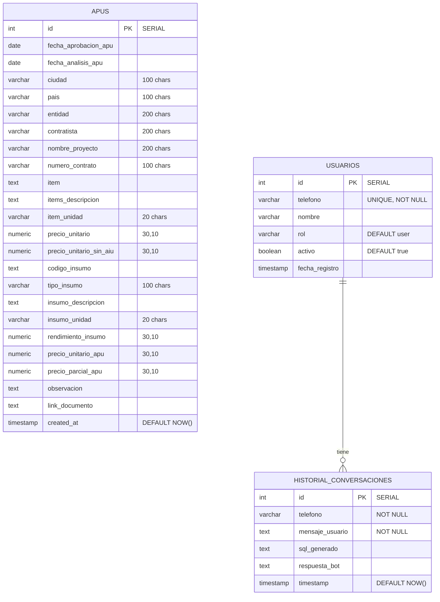

# MAPUS — Technical Documentation

**MAPUS** (Mab APUs) is a full-stack application for extracting, storing, querying, and analyzing Unitary Price Analyses (APU — Analisis de Precios Unitarios) from PDF and Excel documents using Google Gemini AI.

---

## Table of Contents

1. [System Architecture](#1-system-architecture)
2. [Directory Structure](#2-directory-structure)
3. [Database](#3-database)
4. [Backend: main.py](#4-backend-mainpy)
5. [Backend: apu_extractor Package](#5-backend-apu_extractor-package)
6. [Backend: backend_apu Package](#6-backend-backend_apu-package)
7. [Frontend: Angular Application](#7-frontend-angular-application)
8. [API Endpoints Reference](#8-api-endpoints-reference)
9. [Data Flows](#9-data-flows)
10. [AI Integration](#10-ai-integration)
11. [Configuration & Deployment](#11-configuration--deployment)
12. [Development Guide](#12-development-guide)

---

## 1. System Architecture

```
+------------------------------------------------------------------+
|                        BROWSER (Angular 21)                       |
|  +-----------+  +----------+  +-----------+  +------------------+ |
|  | Dashboard |  | Upload & |  | APU Bank  |  | Chat Assistant   | |
|  |   Page    |  | Extract  |  |  (Table)  |  |    Page          | |
|  +-----------+  +----------+  +-----------+  +------------------+ |
|        |              |              |               |             |
|        +--------------+--------------+---------------+             |
|                       | HTTP REST (port 4200 dev)                  |
+-----------------------|-------------------------------------------+
                        |
                  [Vite Dev Server / Nginx Prod]
                        |
                  +-----|-------------------------------------------+
                  |  FASTAPI SERVER (uvicorn, port 10000)           |
                  |     +---------------------------------------+   |
                  |     |            main.py / app.py            |   |
                  |     |  CORS, Routing, Rate Limiter, Auth    |   |
                  |     +---------------------------------------+   |
                  |         |          |           |                |
                  |    +---------+ +---------+ +---------+          |
                  |    |  APU    | | Chat    | | Twilio  |          |
                  |    |Extractor| |Assistant| |WhatsApp |          |
                  |    +---------+ +---------+ +---------+          |
                  |         |          |                            |
                  |    +---------+     |                            |
                  |    | Gemini  |     |                            |
                  |    |   AI    |     |                            |
                  |    +---------+     |                            |
                  |                    v                            |
                  |         +-------------------+                  |
                  |         |  PostgreSQL 16    |                  |
                  |         |  (Docker/PG)      |                  |
                  |         +-------------------+                  |
                  +------------------------------------------------+
                                       |
                        [Docker: postgres:16-alpine]
                        [Cloud SQL Proxy for GCP]
```

### Technology Stack

| Layer | Technology | Version |
|---|---|---|
| Frontend | Angular | 21.x |
| Frontend Build | Vite (via @angular/build) | 21.x |
| Backend | FastAPI (Python) | 0.115.x |
| AI Provider | Google Gemini | gemini-2.5-flash |
| Database | PostgreSQL | 16 (alpine) |
| WhatsApp | Twilio API | 9.x |
| Runtime | Python | 3.11.9 |
| PDF Parsing | pypdf | 4.x |
| Excel Parsing | openpyxl, pandas | 2.x |

---

## 2. Directory Structure

```
apus_mab/
|
+-- main.py                        # Primary FastAPI application (monolithic)
+-- db_config.py                   # Database connection manager (singleton)
+-- init.sql                       # Database schema DDL
+-- Procfile                       # Heroku-style deployment config
+-- docker-compose.yml             # PostgreSQL container definition
+-- requirements.txt               # Python dependencies
+-- runtime.txt                    # Python version for Heroku
+-- .env                           # Environment variables (secrets)
|
+-- apu_extractor/                 # Core extraction library
|   +-- __init__.py                #   Package exports
|   +-- ai_provider.py             #   Gemini/Ollama provider abstraction
|   +-- db_service.py              #   Database CRUD operations
|   +-- gemini_extractor.py        #   Document-to-APU extraction logic
|   +-- pdf_parser.py              #   PDF text/base64 extraction
|   +-- excel_parser.py            #   Excel text extraction
|
+-- backend_apu/                   # Modular backend (alternative to main.py)
|   +-- __init__.py                #   Package exports
|   +-- app.py                     #   FastAPI app factory (create_app)
|   +-- api/__init__.py            #   Router aggregation
|   +-- controllers/
|   |   +-- apus_controller.py     #   APU query endpoints
|   |   +-- chat_controller.py     #   Chat assistant endpoints
|   |   +-- extractor_controller.py #  File extraction endpoints
|   |   +-- job_manager.py         #   Background job manager
|   +-- models/
|   |   +-- apu.py                 #   Pydantic data models
|   +-- services/
|       +-- apu_service.py         #   APU business logic
|       +-- job_manager.py         #   (older) Job manager
|
+-- frontend-apu/
|   +-- apu-frontend/
|       +-- src/
|       |   +-- index.html
|       |   +-- main.ts            # Angular bootstrap
|       |   +-- styles.scss        # Global styles
|       |   +-- environments/      # API URL config (dev/prod)
|       |   +-- app/
|       |       +-- app.ts         # Root component
|       |       +-- app.routes.ts  # Route definitions
|       |       +-- app.config.ts  # Angular providers
|       |       +-- components/sidebar/  # Navigation sidebar
|       |       +-- services/
|       |       |   +-- apu.ts     # API service + interfaces
|       |       |   +-- http.interceptor.ts  # HTTP timeout config
|       |       +-- pages/
|       |           +-- dashboard-apus/     # Dashboard page
|       |           +-- nuevos-apu-ia/      # Upload & extract page
|       |           +-- consulta-apus/      # APU bank table page
|       |           +-- chat-apus/          # Chat assistant page
|       +-- angular.json
|       +-- package.json
|       +-- tsconfig.json
|
+-- scripts/                       # Utility scripts
+-- tests/                         # Test suite
+-- docs/                          # Documentation
```

---

## 3. Database

### Entity-Relationship Diagram



### Table: `apus`

The core data table storing all extracted Unitary Price Analysis records.

| Column | Type | Description |
|---|---|---|
| `id` | SERIAL PK | Auto-increment primary key |
| `fecha_aprobacion_apu` | DATE | APU approval date |
| `fecha_analisis_apu` | DATE | APU analysis date |
| `ciudad` | VARCHAR(100) | City where project is located |
| `pais` | VARCHAR(100) | Country |
| `entidad` | VARCHAR(200) | Entity that issued the APU |
| `contratista` | VARCHAR(200) | Contractor company |
| `nombre_proyecto` | VARCHAR(200) | Project name |
| `numero_contrato` | VARCHAR(100) | Contract number |
| `item` | TEXT | Item code/number |
| `items_descripcion` | TEXT | Item description |
| `item_unidad` | VARCHAR(20) | Item unit of measure |
| `precio_unitario` | NUMERIC(30,10) | Unit price |
| `precio_unitario_sin_aiu` | NUMERIC(30,10) | Unit price without overhead |
| `codigo_insumo` | TEXT | Input material/code |
| `tipo_insumo` | VARCHAR(100) | Input type (Material, Labor, Equipment, etc.) |
| `insumo_descripcion` | TEXT | Input description |
| `insumo_unidad` | VARCHAR(20) | Input unit of measure |
| `rendimiento_insumo` | NUMERIC(30,10) | Input yield/performance |
| `precio_unitario_apu` | NUMERIC(30,10) | APU unit price |
| `precio_parcial_apu` | NUMERIC(30,10) | APU partial price |
| `observacion` | TEXT | Observations |
| `link_documento` | TEXT | Source document link |
| `created_at` | TIMESTAMP | Record creation timestamp |

**Indexes:**
- `idx_apus_proyecto` on `nombre_proyecto`
- `idx_apus_ciudad` on `ciudad`
- `idx_apus_insumo` on `insumo_descripcion`

### Table: `usuarios`

Authorized WhatsApp users.

| Column | Type | Description |
|---|---|---|
| `id` | SERIAL PK | Auto-increment primary key |
| `telefono` | VARCHAR(50) UNIQUE NOT NULL | Phone number (WhatsApp ID) |
| `nombre` | VARCHAR(100) | User display name |
| `rol` | VARCHAR(20) | Role: `user` or `admin` |
| `activo` | BOOLEAN | Whether user is active |
| `fecha_registro` | TIMESTAMP | Registration date |

### Table: `historial_conversaciones`

WhatsApp chat history for the AI assistant.

| Column | Type | Description |
|---|---|---|
| `id` | SERIAL PK | Auto-increment primary key |
| `telefono` | VARCHAR(50) NOT NULL | User phone number |
| `mensaje_usuario` | TEXT NOT NULL | User's message |
| `sql_generado` | TEXT | AI-generated SQL query |
| `respuesta_bot` | TEXT | Bot's response |
| `timestamp` | TIMESTAMP | Message timestamp |

---

## 4. Backend: main.py

**File:** `main.py` (858 lines)

This is the primary FastAPI application. It handles all HTTP requests from the Angular frontend and Twilio WhatsApp webhooks.

### Architecture within main.py

```
main.py
  |
  +-- FastAPI App
  |     +-- CORS Middleware
  |     +-- Rate Limiting Middleware
  |     +-- Twilio Request Validation
  |
  +-- Route Groups
  |     +-- System: GET /, GET /health
  |     +-- Extraction: POST /api/extract-file, POST /api/extract-file-async
  |     +-- Saving: POST /api/save-extracted
  |     +-- Jobs: GET/POST /api/jobs/*
  |     +-- APU Queries: GET /api/apus, GET /api/apus/filter-options
  |     +-- Projects: GET /api/projects, DELETE /api/projects
  |     +-- Dashboard: GET /api/dashboard
  |     +-- Chat: POST /api/chat-assistant
  |     +-- WhatsApp: POST /whatsapp_webhook
  |
  +-- Background Job Runner
        +-- _run_extraction(): Thread-based extraction
        +-- JobManager (imported from backend_apu)
```

### Key Design Decisions

**Two extraction modes:**
1. `POST /api/extract-file` -- Synchronous (with optional `auto_save`). Extracts and returns data directly. Used by the legacy workflow.
2. `POST /api/extract-file-async` -- Asynchronous background job. Returns a `job_id` immediately. The frontend polls `GET /api/jobs/{id}` for progress. Used by the "Nuevos APUS-IA" workflow.

**Streaming save:**
`POST /api/save-extracted` accepts a JSON array and returns an NDJSON (Newline-Delimited JSON) stream. Each line is a progress update `{"type": "progress", "inserted": N, "total": T, "errors": [...]}`. The final line has `"type": "complete"`. This allows the frontend to show real-time progress.

**Rate Limiting:**
The chat assistant endpoint is rate-limited to 30 requests per 60 seconds per IP using an in-memory dictionary.

---

## 5. Backend: apu_extractor Package

This package is the core extraction engine, designed to be importable and reusable independently of the web framework.

### Module Dependencies

```
apu_extractor/
  |
  +-- pdf_parser.py -------> pypdf
  |     Extracts text and base64 from PDFs
  |
  +-- excel_parser.py -----> openpyxl, pandas
  |     Extracts text from Excel files
  |
  +-- ai_provider.py ------> requests (Gemini API) or Ollama
  |     Abstract AI provider with repair-json logic
  |
  +-- gemini_extractor.py --> ai_provider, pdf_parser, excel_parser
  |     Orchestrates extraction: prompt -> AI -> parse -> clean
  |
  +-- db_service.py -------> db_config (psycopg2)
        Database CRUD with batch insert + streaming
```

### Extraction Pipeline

```
PDF/Excel File
      |
      v
Extract text or base64
      |
      v
Build structured prompt + JSON schema
      |
      v
Send to Gemini AI (text or multimodal)
      |
      v
Parse AI response (with JSON repair fallback)
      |
      v
Post-process: clean dates, normalize numbers, fill defaults
      |
      v
Return list of APU dicts
```

### ai_provider.py

This module abstracts the AI backend. Currently supports:

- **Gemini** (default): Uses `generateContent` REST API with structured output (response_mime_type: application/json).
- **Ollama** (alternative): Local LLM via Ollama API.

Key functions:
- `generate_text(prompt, system, timeout)` -- Simple text generation
- `extract_structured(prompt, document_text, schema, timeout)` -- Structured JSON extraction with schema enforcement
- `_repair_json(raw)` -- Attempts to fix malformed JSON (truncated arrays, trailing commas, missing quotes)

### gemini_extractor.py

Orchestrates the full extraction workflow.

**Extraction Strategies:**

1. **PDF Text-based:** Extract text with pypdf, send to Gemini as text + prompt
2. **PDF Multimodal:** Encode PDF pages as base64 images, send to Gemini Vision for direct visual understanding. Falls back to text if multimodal fails.
3. **Excel Batched:** Parse Excel with pandas, extract text in batches of 200 rows, send each batch to Gemini.

**Post-processing** (`post_process_extracted_data`):
- Converts dates to `YYYY-MM-DD` format
- Cleans numeric fields (handles Latin format: `1.234,56` -> `1234.56`)
- Defaults empty fields to `--`
- Fills `link_documento` with source filename

### db_service.py

All database operations for the `apus` table.

**Batch Insert with Fallback:**
- Attempts `executemany` for performance
- If batch fails (e.g., column overflow), falls back to row-by-row insertion
- Each failed row is logged with project and item identifiers

**Streaming Insert:**
- `insert_apus_stream()` is a generator that inserts in configurable batches (default 50)
- Yields `{type, inserted, total, errors}` after each batch
- Used by the `/api/save-extracted` streaming endpoint

**Query with Filters + Sort + Search:**
- `get_apus()` supports:
  - 12 column-specific filters (ILIKE partial match or exact match)
  - Global `search` parameter searches across 12 text columns with `OR`
  - Sort by any allowed column (whitelist in `ALLOWED_SORT_COLUMNS`)
  - Pagination via `LIMIT`/`OFFSET`

---

## 6. Backend: backend_apu Package

This is a modular alternative to `main.py`, organized by concern (controllers, models, services). Both `main.py` and `backend_apu/app.py` are functionally equivalent and can be run independently.

### app.py -- Factory Pattern

```python
def create_app() -> FastAPI:
    app = FastAPI(title="MAPUS API - APU Module", version="2.1.0")
    app.add_middleware(CORS, ...)
    app.include_router(api_router, prefix="/api")
    app.add_route("/", root)
    app.add_route("/health", health)
    return app

app = create_app()  # Module-level singleton
```

### Controller Layer

Each controller is an `APIRouter` that groups related endpoints:

| Controller | Router Prefix | Endpoints |
|---|---|---|
| `apus_controller` | (none, mounted at `/api`) | `/apus`, `/apus/filter-options`, `/projects`, `/dashboard` |
| `extractor_controller` | (none) | `/extract-file`, `/jobs`, `/jobs/{id}`, `/jobs/{id}/stream`, `/save-extracted` |
| `chat_controller` | (none) | `/chat-assistant` |

### Model Layer (Pydantic)

```python
class ApuRecord(BaseModel):
    id: Optional[int] = None
    fecha_aprobacion_apu: Optional[date] = None
    ciudad: str
    nombre_proyecto: str
    item: str
    items_descripcion: str
    # ... 15 more fields

class ApuFilters(BaseModel):
    nombre_proyecto: Optional[str] = None
    ciudad: Optional[str] = None
    items_descripcion: Optional[str] = None
    insumo_descripcion: Optional[str] = None
    tipo_insumo: Optional[str] = None
    limit: int = 50
    offset: int = 0
```

### Job Manager (Thread-Based)

The `JobManager` (in `job_manager.py`) manages background extraction jobs:

- Each job has a unique ID (UUID hex), status, progress tracking, and result
- Jobs run in a `ThreadPoolExecutor` (max 2 concurrent)
- Jobs expire after 2 hours (TTL)
- Thread-safe operations with `threading.Lock`
- Version tracking for progress (so consumers can detect stale updates)

States: `QUEUED` -> `EXTRACTING` -> `POST_PROCESSING` -> `DONE` (or `ERROR`)

---

## 7. Frontend: Angular Application

### Application Structure

```
app/
  +-- app.ts (root component with RouterOutlet + Sidebar)
  +-- app.routes.ts (route definitions)
  +-- app.config.ts (providers: Router, HttpClient, TimeoutInterceptor)
  |
  +-- components/
  |   +-- sidebar/ (navigation sidebar with collapsible menu)
  |
  +-- services/
  |   +-- apu.ts (ApuService + all interfaces)
  |   +-- http.interceptor.ts (2-hour timeout for extraction endpoints)
  |
  +-- pages/
      +-- dashboard-apus/   (dashboard with stats cards)
      +-- nuevos-apu-ia/    (file upload + extraction + save)
      +-- consulta-apus/    (APU bank table with filters/sort/pagination)
      +-- chat-apus/        (AI chat assistant interface)
```

### Route Map

| Path | Component | Description |
|---|---|---|
| `/dashboard-apus` | `DashboardApus` | Statistics overview |
| `/nuevos-apu-ia` | `NuevosApuIa` | Upload, extract, review, and save APUs |
| `/consulta-apus` | `ConsultaApus` | Searchable/sortable APU data table |
| `/chat-apus` | `ChatApus` | Natural-language SQL query assistant |

### Key Component: consulta-apus.ts

This is the most feature-rich component, implementing an Excel-like spreadsheet view.

**Column Definitions:**
All 22 columns of the `apus` table are defined as `ColumnDef` objects with:
- `key`: field name matching the database column
- `label`: display header text
- `type`: `text`, `number`, or `date` (controls formatting)
- `sortable`: whether clicking the header sorts
- `filterable`: whether a filter dropdown is available

**Excel-like Filter Dropdowns:**
Each filterable column header has a "v" icon. Clicking it opens a dropdown with:
- A text input for typing a filter value
- For categorical columns (proyecto, ciudad, tipo_insumo, entidad, contratista): a selectable list of distinct values loaded from `/api/apus/filter-options`
- Type-to-filter within the dropdown options

**Sorting:**
Clicking the column header text toggles ascending/descending sort. The sort indicator shows the current direction.

**Global Search:**
A search bar at the top performs a cross-column text search using the backend `search` parameter (ILIKE across 12 columns).

**Pagination:**
50 rows per page with page navigation.

### Service: apu.ts

Central API service with all HTTP methods. Key details:

- **Streaming Save:** `saveExtractedStreaming()` uses the Fetch API (not Angular HttpClient) to read an NDJSON stream from the backend. Each parsed line is emitted via `saveProgress` Subject.
- **Job Polling:** `streamJobProgress()` polls `GET /api/jobs/{id}` every 2 seconds, emitting `Job` objects until `DONE` or `ERROR`.
- **Filter Options:** `getFilterOptions()` fetches distinct values for filter dropdowns from a dedicated endpoint.

### HTTP Interceptor

The `ExtendedTimeoutInterceptor` applies a 2-hour timeout for extraction endpoints and a 30-second default for all other requests.

---

## 8. API Endpoints Reference

### System

| Method | Path | Parameters | Response |
|---|---|---|---|
| GET | `/` | none | `{status, version, endpoints}` |
| GET | `/health` | none | `{status, database}` |

### File Extraction

| Method | Path | Parameters | Response |
|---|---|---|---|
| POST | `/api/extract-file` | `file` (UploadFile), `auto_save` (bool, default true) | `{success, filename, count, copy_paste_table, insumos, saved?}` |
| POST | `/api/extract-file-async` | `file` (UploadFile) | `{job_id, status, filename}` |
| GET | `/api/jobs/{job_id}` | path: job_id | `Job` object |
| GET | `/api/jobs/{job_id}/stream` | path: job_id | SSE stream |
| GET | `/api/jobs` | `limit` (1-100, default 20) | `{jobs: [...]}` |

### Save Extracted Data

| Method | Path | Request Body | Response |
|---|---|---|---|
| POST | `/api/save-extracted` | JSON array of APU dicts | NDJSON stream: `{type, inserted, total, errors}` |

### APU Query

| Method | Path | Parameters | Response |
|---|---|---|---|
| GET | `/api/apus` | `nombre_proyecto`, `ciudad`, `entidad`, `contratista`, `item`, `codigo_insumo`, `tipo_insumo`, `items_descripcion`, `insumo_descripcion`, `item_unidad`, `insumo_unidad`, `pais`, `numero_contrato`, `search`, `sort_by`, `sort_order` (asc/desc), `limit` (1-500), `offset` | `{total, limit, offset, data: [ApuRecord]}` |
| GET | `/api/apus/filter-options` | none | `{proyectos: [], ciudades: [], tipos_insumo: [], entidades: [], contratistas: []}` |
| GET | `/api/projects` | none | `{projects: [string]}` |
| DELETE | `/api/projects` | `nombre_proyecto` (required) | `{success, deleted}` |

### Dashboard

| Method | Path | Response |
|---|---|---|
| GET | `/api/dashboard` | `{total_apus, total_proyectos, total_ciudades, ultimo_mes}` |

### Chat

| Method | Path | Request Body | Response |
|---|---|---|---|
| POST | `/api/chat-assistant` | `{message, telefono?, nombre?}` | `{reply, sql_query?, results?}` |

### WhatsApp

| Method | Path | Form Data | Response |
|---|---|---|---|
| POST | `/whatsapp_webhook` | `From`, `Body` | `"OK"` or `"UNAUTHORIZED"` |

---

## 9. Data Flows

### Flow 1: File Upload, Extraction and Save (Async)

```
User selects PDF/Excel
        |
        v
1. POST /api/extract-file-async (FormData with file)
        |
        v
2. Backend creates Job (status: QUEUED)
   Returns {job_id, status, filename}
        |
        v
3. Frontend polls GET /api/jobs/{job_id} every 2s
        |
   +----+----+----+---->
   |    |    |    |
   v    v    v    v
   QUEUED -> EXTRACTING -> POST_PROCESSING -> DONE
                                               |
                                               v
4. Job.result contains: {success, filename, count,
                         copy_paste_table, insumos}
        |
        v
5. Frontend displays extracted data for review
        |
        v
6. User clicks "Guardar" -> POST /api/save-extracted
   Body: insumos array
        |
        v
7. Backend streams NDJSON progress:
   {"type":"progress","inserted":5,"total":50}
   {"type":"progress","inserted":10,"total":50}
   ...
   {"type":"complete","inserted":50,"total":50,"errors":[]}
        |
        v
8. Frontend shows progress bar, then confirmation
```

### Flow 2: Query APU Bank

```
User navigates to /consulta-apus
        |
        v
1. Frontend loads filter options:
   GET /api/apus/filter-options
        |
        v
2. Frontend loads first page:
   GET /api/apus?limit=50&offset=0
        |
        v
3. User types in search bar:
   GET /api/apus?search=Bogota&limit=50&offset=0
        |
        v
4. User clicks column header to sort:
   GET /api/apus?sort_by=precio_unitario_apu&sort_order=desc&limit=50&offset=0
        |
        v
5. User opens filter dropdown for "PROYECTO",
   selects a project:
   GET /api/apus?nombre_proyecto=ProjectX&limit=50&offset=0
        |
        v
6. User navigates to page 3:
   GET /api/apus?limit=50&offset=100
```

### Flow 3: WhatsApp Chat Assistant

```
User sends WhatsApp message to Twilio number
        |
        v
1. Twilio forwards to POST /whatsapp_webhook
   Form data: From=+57300..., Body="show me projects in Bogota"
        |
        v
2. Backend checks usuario_autorizado()
        |
        v
3. AI generates SQL from natural language
   "SELECT * FROM apus WHERE ciudad ILIKE '%Bogota%' LIMIT 5"
        |
        v
4. Backend validates read-only SQL, executes query
        |
        v
5. AI generates natural language summary from results
        |
        v
6. Backend sends WhatsApp reply via Twilio API
        |
        v
7. Conversation saved to historial_conversaciones
```

---

## 10. AI Integration

### Provider Abstraction

The `ai_provider.py` module defines a uniform interface for AI backends:

```python
generate_text(prompt, system=None, timeout=60) -> str
extract_structured(prompt, document, schema, timeout) -> dict
```

Currently supports:
- **Gemini** via `generativelanguage.googleapis.com/v1beta/models/`
- **Ollama** via local HTTP API (fallback)

### Extraction Prompt Engineering

The `get_extraction_prompt()` function in `gemini_extractor.py` builds a detailed Spanish-language prompt that instructs the AI to:

1. Extract one record per input/material found in the document
2. Identify: project name, city, entity, contractor, contract number
3. For each line item: item code, description, unit, unit price
4. For each input within an item: input code, type, description, unit, yield, unit price, partial price
5. Return data in a strict JSON array format matching the APU schema

### Structured Output (Gemini)

For PDF extraction with multimodal, the backend uses Gemini's `response_mime_type: application/json` with a `response_schema` that defines the exact JSON structure expected. This reduces parsing errors.

### JSON Repair

When AI output is malformed (truncated, missing brackets, trailing commas), `_repair_json()` applies multiple strategies:
1. Close unclosed arrays `[{...}, {...}` -> `[{...}, {...}]`
2. Fix trailing commas
3. Extract valid JSON from text using regex
4. Try parsing partial arrays with recovery

---

## 11. Configuration & Deployment

### Environment Variables (`.env`)

| Variable | Purpose | Required |
|---|---|---|
| `AI_PROVIDER` | AI backend: `gemini` or `ollama` | Yes |
| `GEMINI_API_KEY` | Gemini API key | Yes (if provider=gemini) |
| `GEMINI_MODEL` | Gemini model name | Yes (if provider=gemini) |
| `DB_HOST` | PostgreSQL host | Yes |
| `DB_PORT` | PostgreSQL port | Yes |
| `DB_NAME` | Database name | Yes |
| `DB_USER` | Database user | Yes |
| `DB_PASSWORD` | Database password | Yes |
| `DB_SSLMODE` | SSL mode (prefer/require/disable) | No |
| `CLOUD_SQL_CONNECTION_NAME` | GCP Cloud SQL instance (optional) | No |
| `ACCOUNT_SID` | Twilio account SID | No (optional for WhatsApp) |
| `AUTH_TOKEN` | Twilio auth token | No |
| `FROM_WHATSAPP` | Twilio WhatsApp sender number | No |
| `CORS_ORIGINS` | Comma-separated allowed origins | No (defaults to `*`) |
| `PORT` | Server port | No (defaults to 10000) |

### Running Locally

**Start PostgreSQL:**
```bash
docker compose up -d postgres
```

**Start Backend:**
```bash
uvicorn main:app --reload --port 10000
# or
uvicorn backend_apu.app:app --reload --port 10000
```

**Start Frontend (dev):**
```bash
cd frontend-apu/apu-frontend
npm run start  # Vite dev server on port 4200
```

### Production Deployment

**Procfile** (Heroku-style):
```
web: uvicorn main:app --host 0.0.0.0 --port ${PORT:-10000}
```

The frontend is built with `ng build` (or `npm run build`) and the output is served via Nginx or any static file server. In production, `environment.prod.ts` sets `apiUrl: '/api'` so the frontend uses a relative path (same-origin proxy).

### Docker

Only PostgreSQL runs in Docker. The backend runs directly with uvicorn. To deploy both:

```yaml
# docker-compose.yml (partial)
services:
  postgres:
    image: postgres:16-alpine
    ports: ["5433:5432"]
    volumes:
      - pgdata:/var/lib/postgresql/data
      - ./init.sql:/docker-entrypoint-initdb.d/init.sql
```

---

## 12. Development Guide

### Adding a New Column to the `apus` Table

1. Add the column to `init.sql`:
   ```sql
   ALTER TABLE apus ADD COLUMN nuevo_campo VARCHAR(100);
   ```
2. Update the Pydantic model in `backend_apu/models/apu.py`:
   ```python
   nuevo_campo: Optional[str] = None
   ```
3. Update the `ApuRecord` interface in `frontend-apu/apu-frontend/src/app/services/apu.ts`
4. Update the `INSERT INTO apus (...)` SQL in `apu_extractor/db_service.py`
5. Update the `ALLOWED_SORT_COLUMNS` set in `apu_extractor/db_service.py` (if the column should be sortable)
6. Add the column to the `columns` array in `consulta-apus.ts`
7. Add the column to the `post_process_extracted_data` function in `gemini_extractor.py`

### Adding a New API Endpoint

1. Add the route handler in `main.py` (or in the appropriate controller in `backend_apu/controllers/`)
2. If adding to `main.py`, add the service function in `apu_extractor/db_service.py` (or appropriate module)
3. Add the TypeScript method in `frontend-apu/apu-frontend/src/app/services/apu.ts`
4. If the endpoint needs a new route, register it in `backend_apu/api/__init__.py` and/or `backend_apu/app.py`

### Debugging Extraction Issues

1. Check `GET /api/jobs/{job_id}` for the job status and error messages
2. Look at the raw Gemini response in the backend logs
3. Test with the synchronous endpoint `POST /api/extract-file` to isolate timing issues
4. Check the `post_process_extracted_data` output for unexpected data transformations
5. Verify the database column types match the data being inserted (VARCHAR limits, NUMERIC precision)

### Common Issues and Solutions

| Issue | Likely Cause | Solution |
|---|---|---|
| 422 on POST /api/save-extracted | Missing `Body()` annotation | Ensure parameter uses `payload: list = Body(...)` |
| Batch INSERT fails with "value too long" | VARCHAR column too small for extracted data | Change column to TEXT or increase VARCHAR length |
| Frontend stuck on "Guardando..." | `fetch` outside Angular zone | Wrap state updates in `ngZone.run()` |
| No filter options in dropdown | Backend not restarted after adding `/api/apus/filter-options` | Restart uvicorn process |
| AI returns malformed JSON | Gemini response truncated | Check `_repair_json()` fallbacks, increase timeout |
| WhatsApp webhook returns UNAUTHORIZED | Phone number not in `usuarios` table | Add user via `scripts/load_users.py` or direct INSERT |

### Testing

Backend tests are in `/tests/`:
```bash
pytest tests/
```

Frontend tests use Vitest:
```bash
cd frontend-apu/apu-frontend
npm test
```

### Code Style

- Python: Follow PEP 8. Use descriptive function/variable names in Spanish (matching domain terminology).
- TypeScript: Follow Angular style guide. Use interfaces for data models, services for API communication.
- Imports: Group in order: Angular core, Angular common, RxJS, project services, project models.
- Error handling: Backend endpoints catch exceptions and return HTTP 500 with a descriptive detail message. Frontend subscriptions handle errors in the `error` callback.
