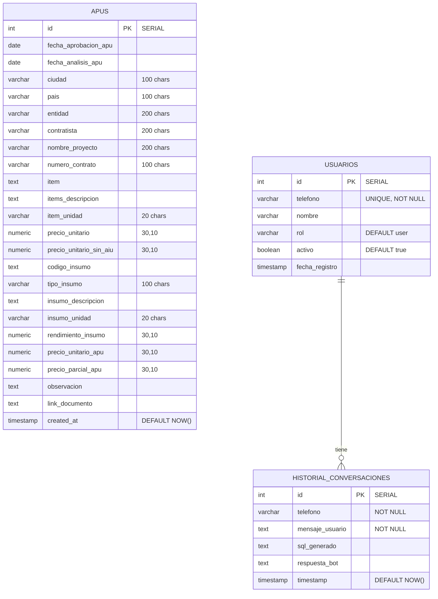

# MAPUS — Documentación Técnica

**MAPUS** (Mab APUs) es una aplicación full-stack para extraer, almacenar, consultar y analizar Análisis de Precios Unitarios (APU) desde documentos PDF y Excel usando IA Google Gemini.

---

## Tabla de Contenidos

1. [Arquitectura del Sistema](#1-arquitectura-del-sistema)
2. [Estructura de Directorios](#2-estructura-de-directorios)
3. [Base de Datos](#3-base-de-datos)
4. [Backend: main.py](#4-backend-mainpy)
5. [Backend: Paquete apu_extractor](#5-backend-paquete-apu_extractor)
6. [Backend: Paquete backend_apu](#6-backend-paquete-backend_apu)
7. [Frontend: Aplicación Angular](#7-frontend-aplicación-angular)
8. [Referencia de Endpoints API](#8-referencia-de-endpoints-api)
9. [Flujos de Datos](#9-flujos-de-datos)
10. [Integración con IA](#10-integración-con-ia)
11. [Configuración y Despliegue](#11-configuración-y-despliegue)
12. [Guía de Desarrollo](#12-guía-de-desarrollo)
13. [Auditoría y Cambios Recientes (Junio 2026)](#13-auditoría-y-cambios-recientes-junio-2026)

---

## 1. Arquitectura del Sistema

```
+------------------------------------------------------------------+
|                        BROWSER (Angular 21)                       |
|  +-----------+  +----------+  +-----------+  +------------------+ |
|  | Dashboard |  | Upload & |  | APU Bank  |  | Chat Assistant   | |
|  |   Page    |  | Extract  |  |  (Table)  |  |    Page          | |
|  +-----------+  +----------+  +-----------+  +------------------+ |
|        |              |              |               |             |
|        +--------------+--------------+---------------+             |
|                       | HTTP REST (port 4200 dev)                  |
+-----------------------|-------------------------------------------+
                        |
                  [Vite Dev Server / Nginx Prod]
                        |
                  +-----|-------------------------------------------+
                  |  FASTAPI SERVER (uvicorn, port 10000)           |
                  |     +---------------------------------------+   |
                  |     |            main.py / app.py            |   |
                  |     |  CORS, Routing, Rate Limiter, Auth    |   |
                  |     +---------------------------------------+   |
                  |         |          |           |                |
                  |    +---------+ +---------+ +---------+          |
                  |    |  APU    | | Chat    | | Twilio  |          |
                  |    |Extractor| |Assistant| |WhatsApp |          |
                  |    +---------+ +---------+ +---------+          |
                  |         |          |                            |
                  |    +---------+     |                            |
                  |    | Gemini  |     |                            |
                  |    |   AI    |     |                            |
                  |    +---------+     |                            |
                  |                    v                            |
                  |         +-------------------+                  |
                  |         |  PostgreSQL 16    |                  |
                  |         |  (Docker/PG)      |                  |
                  |         +-------------------+                  |
                  +------------------------------------------------+
                                       |
                        [Docker: postgres:16-alpine]
                        [Cloud SQL Proxy for GCP]
```

### Stack Tecnológico

| Capa | Tecnología | Versión |
|------|------------|---------|
| Frontend | Angular | 21.x |
| Build Frontend | Vite (via @angular/build) | 21.x |
| Backend | FastAPI (Python) | 0.115.x |
| Proveedor IA | Google Gemini | gemini-2.5-flash |
| Base de Datos | PostgreSQL | 16 (alpine) |
| WhatsApp | Twilio API | 9.x |
| Runtime | Python | 3.11.9 |
| Parseo PDF | pypdf | 4.x |
| Parseo Excel | openpyxl, pandas | 2.x |

---

## 2. Estructura de Directorios

```
apus_mab/
|
+-- main.py                        # Aplicación FastAPI principal
+-- db_config.py                   # Gestor de conexión BD (singleton + pool)
+-- db_schema.py                   # Schema BD centralizado + INSUMO_CATEGORIES
+-- Dockerfile                     # Imagen Docker del backend API
+-- Dockerfile.frontend            # Imagen Docker del frontend (node + nginx)
+-- nginx.conf                     # Configuración Nginx con proxy a la API
+-- init.sql                       # Schema SQL inicial
+-- Procfile                       # Configuración de despliegue Heroku
+-- docker-compose.yml             # PostgreSQL + API + Frontend
+-- pyproject.toml                 # Configuración pytest
+-- requirements.txt               # Dependencias Python
+-- runtime.txt                    # Versión Python para Heroku
+-- .env                           # Variables de entorno (secretos)
+-- usuarios.csv                   # Usuarios autorizados para WhatsApp
|
+-- apu_extractor/                 # Librería de extracción
|   +-- __init__.py                # Exportaciones del paquete
|   +-- ai_provider.py             # Abstracción Gemini/Ollama
|   +-- db_service.py              # Operaciones CRUD BD
|   +-- gemini_extractor.py        # Lógica de extracción documento→APU
|   +-- pdf_parser.py              # Extracción de texto/base64 de PDFs
|   +-- excel_parser.py            # Extracción de texto de Excel
|
+-- backend_apu/                   # Backend modular
|   +-- __init__.py                # Exportaciones del paquete
|   +-- app.py                     # Fábrica de app FastAPI (create_app)
|   +-- sql_validator.py           # Validador SQL unificado
|   +-- api/__init__.py            # Agregador de routers
|   +-- controllers/
|   |   +-- apus_controller.py     # Endpoints de consulta APU
|   |   +-- chat_controller.py     # Endpoints de asistente chat
|   |   +-- extractor_controller.py # Endpoints de extracción
|   |   +-- analisis_apu_controller.py # Flujo de aprobación
|   |   +-- whatsapp_controller.py # Webhook WhatsApp
|   |   +-- job_manager.py         # Gestor de trabajos en segundo plano
|   +-- models/
|   |   +-- apu.py                 # Modelos Pydantic APU
|   |   +-- analisis_apu.py        # Modelos Pydantic de análisis
|   +-- services/
|       +-- apu_service.py         # Lógica de negocio APU
|       +-- analisis_apu_service.py # Lógica de aprobación
|
+-- frontend-apu/
|   +-- apu-frontend/
|       +-- src/
|       |   +-- index.html
|       |   +-- main.ts            # Bootstrap Angular
|       |   +-- styles.scss        # Estilos globales
|       |   +-- environments/      # Config URL API (dev/prod)
|       |   +-- app/
|       |       +-- app.ts         # Componente raíz
|       |       +-- app.routes.ts  # Definiciones de rutas
|       |       +-- app.config.ts  # Providers Angular
|       |       +-- components/sidebar/  # Barra de navegación
|       |       +-- services/
|       |       |   +-- apu.ts     # Servicio API + interfaces
|       |       |   +-- http.interceptor.ts  # Timeout HTTP
|       |       +-- pages/
|       |           +-- dashboard-apus/     # Dashboard
|       |           +-- nuevos-apu-ia/      # Carga y extracción
|       |           +-- consulta-apus/      # Tabla de APUs
|       |           +-- chat-apus/          # Chat asistente
|       |           +-- analisis-apu/       # Flujo de aprobación
|       +-- angular.json
|       +-- package.json
|       +-- tsconfig.json
|
+-- scripts/                       # Scripts utilitarios
+-- tests/                         # Suite de pruebas
+-- docs/                          # Documentación
```

---

## 3. Base de Datos

### Diagrama Entidad-Relación



### Tabla: `apus`

Tabla principal que almacena todos los registros de APU extraídos.

| Columna | Tipo | Descripción |
|---------|------|-------------|
| `id` | SERIAL PK | Clave primaria autoincremental |
| `fecha_aprobacion_apu` | DATE | Fecha de aprobación del APU |
| `fecha_analisis_apu` | DATE | Fecha de análisis del APU |
| `ciudad` | VARCHAR(100) | Ciudad del proyecto |
| `pais` | VARCHAR(100) | País |
| `entidad` | VARCHAR(200) | Entidad que emitió el APU |
| `contratista` | VARCHAR(200) | Empresa contratista |
| `nombre_proyecto` | VARCHAR(200) | Nombre del proyecto |
| `numero_contrato` | VARCHAR(100) | Número de contrato |
| `item` | TEXT | Código/número del ítem |
| `items_descripcion` | TEXT | Descripción del ítem |
| `item_unidad` | VARCHAR(20) | Unidad de medida del ítem |
| `precio_unitario` | NUMERIC(30,10) | Precio unitario |
| `precio_unitario_sin_aiu` | NUMERIC(30,10) | Precio unitario sin AIU |
| `codigo_insumo` | TEXT | Código del insumo |
| `tipo_insumo` | VARCHAR(100) | Tipo de insumo (Material, Mano de obra, Equipo, etc.) |
| `insumo_descripcion` | TEXT | Descripción del insumo |
| `insumo_unidad` | VARCHAR(20) | Unidad de medida del insumo |
| `rendimiento_insumo` | NUMERIC(30,10) | Rendimiento del insumo |
| `precio_unitario_apu` | NUMERIC(30,10) | Precio unitario del APU |
| `precio_parcial_apu` | NUMERIC(30,10) | Precio parcial del APU |
| `observacion` | TEXT | Observaciones |
| `link_documento` | TEXT | Enlace al documento fuente |
| `created_at` | TIMESTAMP | Fecha de creación del registro |

**Índices:**
- `idx_apus_proyecto` en `nombre_proyecto`
- `idx_apus_ciudad` en `ciudad`
- `idx_apus_insumo` en `insumo_descripcion`

### Tabla: `usuarios`

Usuarios autorizados para WhatsApp.

| Columna | Tipo | Descripción |
|---------|------|-------------|
| `id` | SERIAL PK | Clave primaria autoincremental |
| `telefono` | VARCHAR(50) UNIQUE NOT NULL | Número de teléfono (ID de WhatsApp) |
| `nombre` | VARCHAR(100) | Nombre visible del usuario |
| `rol` | VARCHAR(20) | Rol: `user` o `admin` |
| `activo` | BOOLEAN | Si el usuario está activo |
| `fecha_registro` | TIMESTAMP | Fecha de registro |

### Tabla: `historial_conversaciones`

Historial de chat de WhatsApp para el asistente IA.

| Columna | Tipo | Descripción |
|---------|------|-------------|
| `id` | SERIAL PK | Clave primaria autoincremental |
| `telefono` | VARCHAR(50) NOT NULL | Número de teléfono del usuario |
| `mensaje_usuario` | TEXT NOT NULL | Mensaje del usuario |
| `sql_generado` | TEXT | Consulta SQL generada por IA |
| `respuesta_bot` | TEXT | Respuesta del bot |
| `timestamp` | TIMESTAMP | Fecha y hora del mensaje |

---

## 4. Backend: main.py

**Archivo:** `main.py` (257 líneas)

Este es el punto de entrada principal de FastAPI, que integra los routers del paquete `backend_apu` y añade endpoints específicos de WhatsApp, health check y rate limiting.

### Arquitectura

```
main.py
  |
  +-- App FastAPI (con lifespan)
  |     +-- CORS Middleware
  |     +-- Rate Limiting Middleware (30 req/min por IP para chat)
  |
  +-- Routers importados de backend_apu
  |     +-- api_router → /api/v1/* y /api/*
  |     +-- whatsapp_router → /whatsapp_webhook
  |
  +-- Endpoints propios
  |     +-- GET /, GET /health
  |     +-- POST /api/extract-file-async
  |
  +-- Worker de extracción asíncrona
        +-- _run_extraction(): Extracción basada en hilos
        +-- submit_job() vía JobManager
```

### Decisiones de Diseño Clave

**Routers del backend_apu:** main.py importa `api_router` de `backend_apu/api/__init__.py`, que agrega todos los controladores (apus, extractor, chat, análisis). Esto evita duplicación de endpoints.

**Dos prefijos API:** El api_router se monta en `/api/v1` (canónico) y `/api` (legacy), manteniendo compatibilidad hacia atrás mientras se promueve la nueva versión.

**Extracción asíncrona:** `POST /api/extract-file-async` recibe un archivo, crea un trabajo en JobManager y retorna inmediatamente un `job_id`. El frontend consulta `GET /api/jobs/{id}` para conocer el progreso.

**Rate Limiting:** El endpoint `/api/chat-assistant` tiene un límite de 30 solicitudes por 60 segundos por IP usando un diccionario en memoria.

---

## 5. Backend: Paquete apu_extractor

Este paquete es el motor de extracción principal, diseñado para ser importable y reutilizable independientemente del framework web.

### Dependencias entre Módulos

```
apu_extractor/
  |
  +-- pdf_parser.py -------> pypdf
  |     Extrae texto y base64 de PDFs
  |
  +-- excel_parser.py -----> openpyxl, pandas
  |     Extrae texto de archivos Excel
  |
  +-- ai_provider.py ------> requests (Gemini API) o Ollama
  |     Proveedor IA abstracto con reparación de JSON
  |
  +-- gemini_extractor.py --> ai_provider, pdf_parser, excel_parser
  |     Orquesta la extracción: prompt → IA → parseo → limpieza
  |
  +-- db_service.py -------> db_config (psycopg2)
        CRUD de BD con inserción por lotes + streaming
```

### Pipeline de Extracción

```
Archivo PDF/Excel
      |
      v
Extraer texto o base64
      |
      v
Construir prompt estructurado + schema JSON
      |
      v
Enviar a Gemini IA (texto o multimodal)
      |
      v
Parsear respuesta IA (con reparación JSON de respaldo)
      |
      v
Post-procesar: limpiar fechas, normalizar números, valores por defecto
      |
      v
Retornar lista de diccionarios APU
```

### ai_provider.py

Este módulo abstrae el backend de IA. Actualmente soporta:

- **Gemini** (default): Usa la API REST `generateContent` con salida estructurada (`response_mime_type: application/json`).
- **Ollama** (alternativa): LLM local vía API de Ollama.

Funciones principales:
- `generate_text(prompt, system, timeout)` — Generación de texto simple
- `extract_structured(prompt, document_text, schema, timeout)` — Extracción JSON estructurada con esquema
- `_repair_json(raw)` — Intenta reparar JSON malformado (arrays truncados, comas finales, comillas faltantes)

### gemini_extractor.py

Orquesta el flujo completo de extracción.

**Estrategias de Extracción:**

1. **PDF basado en texto:** Extrae texto con pypdf, envía a Gemini como texto + prompt
2. **PDF Multimodal:** Codifica páginas PDF como imágenes base64, envía a Gemini Vision para comprensión visual directa. Reintenta con texto si falla el multimodal.
3. **Excel por lotes:** Parsea Excel con pandas, extrae texto en lotes de 200 filas, envía cada lote a Gemini.

**Post-procesamiento** (`post_process_extracted_data`):
- Convierte fechas a formato `YYYY-MM-DD`
- Limpia campos numéricos (maneja formato latino: `1.234,56` → `1234.56`)
- Campos vacíos por defecto a `--`
- Asigna `link_documento` con el nombre del archivo fuente

### db_service.py

Todas las operaciones de base de datos para la tabla `apus`.

**Inserción por Lotes con Reintento:**
- Intenta `executemany` para rendimiento
- Si falla el lote (ej. desbordamiento de columna), reintenta fila por fila
- Cada fila fallida se registra con identificadores de proyecto e ítem

**Inserción Streaming:**
- `insert_apus_stream()` es un generador que inserta en lotes configurables (default 50)
- Emite `{type, inserted, total, errors}` después de cada lote
- Usado por el endpoint `/api/save-extracted`

**Consulta con Filtros + Orden + Búsqueda:**
- `get_apus()` soporta:
  - 12 filtros por columna (ILIKE coincidencia parcial o exacta)
  - Búsqueda global `search` que recorre 12 columnas de texto con `OR`
  - Ordenamiento por cualquier columna permitida (lista blanca en `ALLOWED_SORT_COLUMNS`)
  - Paginación vía `LIMIT`/`OFFSET`

---

## 6. Backend: Paquete backend_apu

Backend modular organizado por capas (controladores, modelos, servicios). El punto de entrada `main.py` importa `api_router` de este paquete y añade endpoints específicos de WhatsApp.

### app.py — Patrón Factory

```python
def create_app() -> FastAPI:
    app = FastAPI(title="MAPUS API - APU Module", version="2.1.0")
    app.add_middleware(CORS, ...)
    app.include_router(api_router, prefix="/api/v1")
    app.include_router(api_router, prefix="/api")
    app.add_route("/", root)
    app.add_route("/health", health)
    return app

app = create_app()  # Singleton a nivel de módulo
```

### Capa de Controladores

Cada controlador es un `APIRouter` que agrupa endpoints relacionados:

| Controlador | Prefijo | Endpoints |
|---|---|---|
| `apus_controller` | (ninguno, montado en `/api`) | `/apus`, `/apus/filter-options`, `/projects`, `/dashboard`, DELETE `/projects` |
| `extractor_controller` | (ninguno) | `/extract-file`, `/jobs`, `/jobs/{id}`, `/jobs/{id}/stream`, `/save-extracted` |
| `chat_controller` | (ninguno) | `/chat-assistant` |
| `whatsapp_controller` | (ninguno, montado en raíz) | `/whatsapp_webhook` |
| `job_manager` | (interno, sin endpoints) | Ejecutor de trabajos asíncronos basado en ThreadPool |
| `analisis_apu_controller` | (ninguno) | `/analisis-apu/upload`, `/analisis-apu/crear`, `/analisis-apu/{id}/analizar`, etc. |

### Validador SQL (`sql_validator.py`)

Validador unificado de consultas SQL de solo lectura, usado por `main.py` y `chat_controller.py`:
- **Lista blanca** de 8 tablas permitidas (`apus`, `usuarios`, `historial_conversaciones`, etc.)
- **Lista negra** de 10 palabras SQL peligrosas (DROP, DELETE, INSERT, etc.)
- **Lista negra** de 12 funciones PostgreSQL peligrosas (`pg_sleep`, `current_setting`, `pg_read_file`, etc.)
- Límite forzado de `LIMIT 20`, rechazo de `SELECT *`, detección de multi-consultas
- Retorna tupla `(is_valid: bool, validated_sql: str)`

### Controlador WhatsApp (`whatsapp_controller.py`)

Maneja el webhook de Twilio WhatsApp en `POST /whatsapp_webhook`:
- Verificación de firma Twilio
- Autorización de usuario contra tabla `usuarios`
- Memoria conversacional (últimos 5 turnos de `historial_conversaciones`)
- Generación SQL vía Gemini + validación vía `sql_validator.py`
- Segmentación de respuestas (máx. 1500 caracteres para WhatsApp) con `await asyncio.sleep(2)` entre segmentos

### Capa de Modelos (Pydantic)

```python
class ApuRecord(BaseModel):
    id: Optional[int] = None
    fecha_aprobacion_apu: Optional[date] = None
    ciudad: str
    nombre_proyecto: str
    item: str
    items_descripcion: str
    # ... 15 campos más

class ApuFilters(BaseModel):
    nombre_proyecto: Optional[str] = None
    ciudad: Optional[str] = None
    items_descripcion: Optional[str] = None
    insumo_descripcion: Optional[str] = None
    tipo_insumo: Optional[str] = None
    limit: int = 50
    offset: int = 0
```

### Gestor de Trabajos (Basado en Hilos)

El `JobManager` (en `job_manager.py`) gestiona trabajos de extracción en segundo plano:

- Cada trabajo tiene un ID único (UUID hex), estado, seguimiento de progreso y resultado
- Los trabajos se ejecutan en un `ThreadPoolExecutor` (máx. 2 concurrentes)
- Los trabajos expiran después de 2 horas (TTL)
- Operaciones thread-safe con `threading.Lock`
- Seguimiento de versión para que los consumidores detecten actualizaciones obsoletas

Estados: `QUEUED` → `EXTRACTING` → `POST_PROCESSING` → `DONE` (o `ERROR`)

---

## 7. Frontend: Aplicación Angular

### Estructura de la Aplicación

```
app/
  +-- app.ts (componente raíz con RouterOutlet + Sidebar)
  +-- app.routes.ts (definiciones de ruta)
  +-- app.config.ts (providers: Router, HttpClient, TimeoutInterceptor)
  |
  +-- components/
  |   +-- sidebar/ (barra de navegación lateral con menú colapsable)
  |
  +-- services/
  |   +-- apu.ts (ApuService + todas las interfaces)
  |   +-- http.interceptor.ts (timeout de 2 horas para extracción)
  |
  +-- pages/
      +-- dashboard-apus/   (dashboard con tarjetas de estadísticas)
      +-- nuevos-apu-ia/    (carga de archivos + extracción + guardado)
      +-- consulta-apus/    (tabla de APUs con filtros/orden/paginación)
      +-- chat-apus/        (interfaz de chat asistente IA)
      +-- analisis-apu/     (flujo de aprobación de APUs)
```

### Mapa de Rutas

| Ruta | Componente | Descripción |
|------|------------|-------------|
| `/dashboard-apus` | `DashboardApus` | Resumen de estadísticas |
| `/nuevos-apu-ia` | `NuevosApuIa` | Cargar, extraer, revisar y guardar APUs |
| `/consulta-apus` | `ConsultaApus` | Tabla de datos APU con búsqueda y orden |
| `/chat-apus` | `ChatApus` | Asistente de consultas SQL en lenguaje natural |
| `/analisis-apu` | `AnalisisApu` | Flujo de aprobación de APUs |

### Componente Clave: consulta-apus.ts

Es el componente más completo, implementando una vista tipo hoja de cálculo.

**Definiciones de Columna:**
Las 22 columnas de la tabla `apus` se definen como objetos `ColumnDef` con:
- `key`: nombre del campo que coincide con la columna de BD
- `label`: texto del encabezado mostrado
- `type`: `text`, `number` o `date` (controla el formato)
- `sortable`: si al hacer clic en el encabezado ordena
- `filterable`: si hay un menú de filtro disponible

**Filtros tipo Excel:**
Cada encabezado de columna filtrable tiene un ícono "v". Al hacer clic se abre un menú con:
- Un campo de texto para escribir un valor de filtro
- Para columnas categóricas (proyecto, ciudad, tipo_insumo, entidad, contratista): una lista seleccionable de valores distintos cargados desde `/api/apus/filter-options`
- Filtro por escritura dentro de las opciones del menú

**Ordenamiento:**
Al hacer clic en el texto del encabezado de columna se alterna entre orden ascendente/descendente. El indicador de orden muestra la dirección actual.

**Búsqueda Global:**
Una barra de búsqueda en la parte superior realiza una búsqueda de texto en múltiples columnas usando el parámetro `search` del backend (ILIKE en 12 columnas).

**Paginación:**
50 filas por página con navegación de páginas.

### Servicio: apu.ts

Servicio API central con todos los métodos HTTP. Detalles clave:

- **Guardado Streaming:** `saveExtractedStreaming()` usa Fetch API (no Angular HttpClient) para leer un flujo NDJSON del backend. Cada línea parseada se emite vía `saveProgress` Subject.
- **Consulta de Trabajos:** `streamJobProgress()` consulta `GET /api/jobs/{id}` cada 2 segundos, emitiendo objetos `Job` hasta `DONE` o `ERROR`.
- **Opciones de Filtro:** `getFilterOptions()` obtiene valores distintos para menús de filtro desde un endpoint dedicado.

### Interceptor HTTP

El `ExtendedTimeoutInterceptor` aplica un timeout de 2 horas para endpoints de extracción y 30 segundos por defecto para todas las demás solicitudes.

---

## 8. Referencia de Endpoints API

### Sistema

| Método | Ruta | Parámetros | Respuesta |
|--------|------|-------------|-----------|
| GET | `/` | ninguno | `{status, version, endpoints}` |
| GET | `/health` | ninguno | `{status, database}` |

### Extracción de Archivos

| Método | Ruta | Parámetros | Respuesta |
|--------|------|-------------|-----------|
| POST | `/api/extract-file` | `file` (UploadFile) | `{success, job_id, message}` (procesamiento asíncrono) |
| POST | `/api/extract-file-async` | `file` (UploadFile) | `{job_id, status, filename}` |
| GET | `/api/jobs/{job_id}` | path: job_id | Objeto `Job` |
| GET | `/api/jobs/{job_id}/stream` | path: job_id | Flujo SSE |
| GET | `/api/jobs` | `limit` (1-100, default 20) | `{jobs: [...]}` |

### Guardado de Datos Extraídos

| Método | Ruta | Cuerpo | Respuesta |
|--------|------|--------|-----------|
| POST | `/api/save-extracted` | Array JSON de APUs | Flujo NDJSON: `{type, inserted, total, errors}` |

### Consulta de APUs

| Método | Ruta | Parámetros | Respuesta |
|--------|------|-------------|-----------|
| GET | `/api/apus` | `nombre_proyecto`, `ciudad`, `entidad`, `contratista`, `item`, `codigo_insumo`, `tipo_insumo`, `items_descripcion`, `insumo_descripcion`, `item_unidad`, `insumo_unidad`, `pais`, `numero_contrato`, `search`, `sort_by`, `sort_order` (asc/desc), `limit` (1-500), `offset` | `{total, limit, offset, data: [ApuRecord]}` |
| GET | `/api/apus/filter-options` | ninguno | `{proyectos: [], ciudades: [], tipos_insumo: [], entidades: [], contratistas: []}` |
| GET | `/api/projects` | ninguno | `{projects: [string]}` |
| DELETE | `/api/projects` | `nombre_proyecto` (requerido) | `{success, deleted}` |

### Dashboard

| Método | Ruta | Respuesta |
|--------|------|-----------|
| GET | `/api/dashboard` | `{total_apus, total_proyectos, total_ciudades, completitud_datos}` |

### Chat

| Método | Ruta | Cuerpo | Respuesta |
|--------|------|--------|-----------|
| POST | `/api/chat-assistant` | `{message, telefono?, nombre?}` | `{reply, sql_query?, results?}` |

### WhatsApp

| Método | Ruta | Datos de Formulario | Respuesta |
|--------|------|---------------------|-----------|
| POST | `/whatsapp_webhook` | `From`, `Body` | `"OK"` o `"UNAUTHORIZED"` |

---

## 9. Flujos de Datos

### Flujo 1: Carga de Archivo, Extracción y Guardado (Asíncrono)

```
Usuario selecciona PDF/Excel
        |
        v
1. POST /api/extract-file (FormData con archivo)
        |
        v
2. Backend crea Job (status: QUEUED)
   Retorna {success, job_id, message}
        |
        v
3. Frontend consulta GET /api/jobs/{job_id} cada 2s
        |
   +----+----+----+---->
   |    |    |    |
   v    v    v    v
   QUEUED -> EXTRACTING -> POST_PROCESSING -> DONE
                                               |
                                               v
4. Job.result contiene: {success, filename, count,
                         copy_paste_table, insumos}
        |
        v
5. Frontend muestra datos extraídos para revisión
        |
        v
6. Usuario hace clic en "Guardar" → POST /api/save-extracted
   Cuerpo: array de insumos
        |
        v
7. Backend transmite progreso NDJSON:
   {"type":"progress","inserted":5,"total":50}
   {"type":"progress","inserted":10,"total":50}
   ...
   {"type":"complete","inserted":50,"total":50,"errors":[]}
        |
        v
8. Frontend muestra barra de progreso y confirmación
```

### Flujo 2: Consulta de APUs

```
Usuario navega a /consulta-apus
        |
        v
1. Frontend carga opciones de filtro:
   GET /api/apus/filter-options
        |
        v
2. Frontend carga primera página:
   GET /api/apus?limit=50&offset=0
        |
        v
3. Usuario escribe en barra de búsqueda:
   GET /api/apus?search=Bogota&limit=50&offset=0
        |
        v
4. Usuario hace clic en encabezado para ordenar:
   GET /api/apus?sort_by=precio_unitario_apu&sort_order=desc&limit=50&offset=0
        |
        v
5. Usuario abre filtro para "PROYECTO",
   selecciona un proyecto:
   GET /api/apus?nombre_proyecto=ProjectX&limit=50&offset=0
        |
        v
6. Usuario navega a página 3:
   GET /api/apus?limit=50&offset=100
```

### Flujo 3: Asistente WhatsApp

```
Usuario envía mensaje WhatsApp al número de Twilio
        |
        v
1. Twilio reenvía a POST /whatsapp_webhook
   Form data: From=+57300..., Body="muéstrame proyectos en Bogotá"
        |
        v
2. Backend verifica usuario_autorizado()
        |
        v
3. IA genera SQL desde lenguaje natural
   "SELECT * FROM apus WHERE ciudad ILIKE '%Bogotá%' LIMIT 5"
        |
        v
4. Backend valida SQL de solo lectura, ejecuta consulta
        |
        v
5. IA genera resumen en lenguaje natural desde resultados
        |
        v
6. Backend envía respuesta WhatsApp vía API de Twilio
        |
        v
7. Conversación guardada en historial_conversaciones
```

---

## 10. Integración con IA

### Abstracción del Proveedor

El módulo `ai_provider.py` define una interfaz uniforme para los backends de IA:

```python
generate_text(prompt, system=None, timeout=60) -> str
extract_structured(prompt, document, schema, timeout) -> dict
```

Actualmente soporta:
- **Gemini** vía `generativelanguage.googleapis.com/v1beta/models/`
- **Ollama** vía API HTTP local (respaldo)

### Ingeniería de Prompts de Extracción

La función `get_extraction_prompt()` en `gemini_extractor.py` construye un prompt detallado en español que instruye a la IA para:

1. Extraer un registro por cada insumo/material encontrado en el documento
2. Identificar: nombre del proyecto, ciudad, entidad, contratista, número de contrato
3. Por cada ítem: código, descripción, unidad, precio unitario
4. Por cada insumo dentro de un ítem: código, tipo, descripción, unidad, rendimiento, precio unitario, precio parcial
5. Retornar datos en formato JSON array estricto que coincide con el schema APU

### Salida Estructurada (Gemini)

Para extracción de PDF con multimodal, el backend usa `response_mime_type: application/json` de Gemini con un `response_schema` que define la estructura JSON exacta esperada. Esto reduce errores de parseo.

### Reparación JSON

Cuando la salida de IA está malformada (truncada, faltan corchetes, comas finales), `_repair_json()` aplica múltiples estrategias:
1. Cierra arrays no cerrados `[{...}, {...}` → `[{...}, {...}]`
2. Corrige comas finales
3. Extrae JSON válido del texto usando regex
4. Intenta parsear arrays parciales con recuperación

---

## 11. Configuración y Despliegue

### Variables de Entorno (`.env`)

| Variable | Propósito | Requerida |
|----------|-----------|-----------|
| `AI_PROVIDER` | Backend IA: `gemini` o `ollama` | Sí |
| `GEMINI_API_KEY` | Clave API de Gemini | Sí (si provider=gemini) |
| `GEMINI_MODEL` | Nombre del modelo Gemini | Sí (si provider=gemini) |
| `DB_HOST` | Host de PostgreSQL | Sí |
| `DB_PORT` | Puerto de PostgreSQL | Sí |
| `DB_NAME` | Nombre de la base de datos | Sí |
| `DB_USER` | Usuario de base de datos | Sí |
| `DB_PASSWORD` | Contraseña de base de datos | Sí |
| `DB_SSLMODE` | Modo SSL (prefer/require/disable) | No |
| `CLOUD_SQL_CONNECTION_NAME` | Instancia GCP Cloud SQL (opcional) | No |
| `ACCOUNT_SID` | SID de cuenta Twilio | No (opcional para WhatsApp) |
| `AUTH_TOKEN` | Token de autenticación Twilio | No |
| `FROM_WHATSAPP` | Número remitente de Twilio WhatsApp | No |
| `CORS_ORIGINS` | Orígenes permitidos separados por coma | No (default `*`) |
| `PORT` | Puerto del servidor | No (default 10000) |
| `ENV` | Entorno: `development` o `production` | No |

### Ejecución Local

**Iniciar PostgreSQL:**
```bash
docker compose up -d postgres
```

**Iniciar Backend:**
```bash
uvicorn main:app --reload --port 10000
# o
uvicorn backend_apu.app:app --reload --port 10000
```

**Iniciar Frontend (desarrollo):**
```bash
cd frontend-apu/apu-frontend
npm run start  # Servidor Vite en puerto 4200
```

### Despliegue en Producción

**Procfile** (estilo Heroku):
```
web: uvicorn main:app --host 0.0.0.0 --port ${PORT:-10000}
```

El frontend se compila con `ng build` (o `npm run build`) y la salida se sirve vía Nginx o cualquier servidor de archivos estáticos. En producción, `environment.prod.ts` usa `apiUrl: '/api/v1'` para que el frontend use una ruta relativa (proxy mismo-origen).

### Docker

El proyecto completo se despliega con Docker Compose:

```bash
docker compose up -d
```

Esto levanta 3 servicios:
- `postgres`: PostgreSQL 16 Alpine con healthcheck
- `api`: Backend FastAPI (python:3.11-slim + uvicorn)
- `frontend`: Frontend Angular servido por Nginx (build multi-stage)

El frontend expone el puerto 8080 con Nginx configurado para:
- Servir archivos estáticos de Angular
- Proxy reverso de `/api/*` y `/whatsapp_webhook` hacia el backend

---

## 12. Guía de Desarrollo

### Agregar una Nueva Columna a la Tabla `apus`

1. Agregar la columna a `init.sql`:
   ```sql
   ALTER TABLE apus ADD COLUMN nuevo_campo VARCHAR(100);
   ```
2. Actualizar el modelo Pydantic en `backend_apu/models/apu.py`:
   ```python
   nuevo_campo: Optional[str] = None
   ```
3. Actualizar la interfaz `ApuRecord` en `frontend-apu/apu-frontend/src/app/services/apu.ts`
4. Actualizar el SQL `INSERT INTO apus (...)` en `apu_extractor/db_service.py`
5. Actualizar el conjunto `ALLOWED_SORT_COLUMNS` en `backend_apu/services/apu_service.py` (si la columna debe ser ordenable)
6. Agregar la columna al array `columns` en `consulta-apus.ts`
7. Agregar la columna a la función `post_process_extracted_data` en `gemini_extractor.py`

### Agregar un Nuevo Endpoint API

1. Agregar el manejador de ruta en el controlador apropiado en `backend_apu/controllers/`
2. Agregar la función de servicio en `backend_apu/services/` (o módulo apropiado)
3. Agregar el método TypeScript en `frontend-apu/apu-frontend/src/app/services/apu.ts`
4. Si el endpoint necesita una nueva ruta, registrarlo en `backend_apu/api/__init__.py`

### Depuración de Problemas de Extracción

1. Verificar `GET /api/jobs/{job_id}` para el estado del trabajo y mensajes de error
2. Revisar la respuesta cruda de Gemini en los logs del backend
3. Probar con el endpoint `POST /api/extract-file` del extractor_controller para aislar problemas de temporización
4. Verificar la salida de `post_process_extracted_data` para transformaciones inesperadas
5. Confirmar que los tipos de columna de BD coinciden con los datos insertados (límites VARCHAR, precisión NUMERIC)

### Problemas Comunes y Soluciones

| Problema | Causa Probable | Solución |
|----------|----------------|----------|
| 422 en POST /api/save-extracted | Falta anotación `Body()` | Asegurar que el parámetro usa `payload: list[dict[str, Any]] = Body(...)` |
| INSERT por lotes falla "value too long" | Columna VARCHAR muy pequeña | Cambiar columna a TEXT o aumentar longitud VARCHAR |
| Frontend se queda en "Guardando..." | `fetch` fuera del zona Angular | Envolver actualizaciones de estado en `ngZone.run()` |
| Sin opciones de filtro en menú | Backend no reiniciado tras agregar `/api/apus/filter-options` | Reiniciar proceso uvicorn |
| IA retorna JSON malformado | Respuesta Gemini truncada | Verificar fallbacks de `_repair_json()`, aumentar timeout |
| Webhook WhatsApp retorna UNAUTHORIZED | Número no está en tabla `usuarios` | Agregar usuario vía `scripts/load_users.py` o INSERT directo |

### Pruebas

Pruebas de backend (pytest):
```bash
pytest tests/ -v
```
35 pruebas que cubren validación SQL (15), formateadores (19) y utilidades de extracción (3). Todas pasan con 0 advertencias.

Pruebas de frontend con Vitest:
```bash
cd frontend-apu/apu-frontend
npm test
```

### Estilo de Código

- Python: Seguir PEP 8. Usar nombres de funciones/variables descriptivos en español (acordes al dominio).
- TypeScript: Seguir guía de estilo Angular. Usar interfaces para modelos de datos, services para comunicación API.
- Imports: Agrupar en orden: Angular core, Angular common, RxJS, servicios del proyecto, modelos del proyecto.
- Manejo de errores: Los endpoints del backend capturan excepciones y retornan HTTP 500 con mensaje descriptivo. Las suscripciones del frontend manejan errores en el callback `error`.

---

## 13. Auditoría y Cambios Recientes (Junio 2026)

Se completaron dos fases de auditoría. Ver `docs/auditoria-completa.md` para el informe completo.

### Fase 1 — Seguridad y Arquitectura (20 hallazgos, 100% resueltos)

| Categoría | Resueltos | Cambios clave |
|-----------|-----------|---------------|
| 🔴 Crítico | 4/4 | JobManager unificado, schemas centralizados, validador SQL creado |
| 🟠 Alto | 4/4 | DBEncoder unificado, funciones BD delegadas, pytest agregado, pool conexiones |
| 🟡 Medio | 6/6 | Archivos legacy eliminados, ENV/puerto documentados, logging mejorado |
| 🟢 Bajo | 6/6 | Docker completado, API versionada, async sleep, precisión renombrada |

### Fase 2 — Calidad de Código (35 hallazgos, 10 resueltos, 25 pendientes)

| # | Hallazgo | Severidad | Estado |
|---|----------|-----------|--------|
| 1 | `@app.on_event("startup")` deprecado | 🔴 Alta | ✅ Migrado a `lifespan` |
| 2-7 | Imports no usados en 5 archivos | 🟠 Media | ✅ Limpiados |
| 8-10 | Código muerto (`ApuResponse`, `ErrorResponse`, auto-reasignación) | 🟢 Baja | ✅ Eliminado |
| 11 | Cadena de imports circulares (import diferido) | 🟠 Media | ⏳ Pendiente refactor |
| 12 | API key en URL vs header | 🟢 Baja | ⏳ Pendiente |
| 13 | Sin reintento/backoff en `generate_text` | 🟠 Media | ⏳ Pendiente |
| 14 | Excepción silenciosa en clasificación | 🟢 Baja | ⏳ Pendiente |
| 15 | 9 métodos sin context manager para BD | 🟠 Media | ⏳ Pendiente |
| 16 | 20+ funciones sin type hints de retorno | 🟠 Media | ⏳ Pendiente |
| 17-18 | Uso de `Any` + inconsistencia `list`/`List` | 🟢 Baja | ⏳ Pendiente |
| 19 | Falta `__init__.py` en `tests/` y `scripts/` | 🟢 Baja | ✅ Agregados |
| 20-22 | Archivos grandes (>500 líneas) | 🟠 Media | ⏳ Pendiente dividir |
| 23 | Riesgo SQL injection en script dev | 🔴 Alta | ⏳ Script dev, riesgo bajo |
| 24 | ORDER BY con f-string | 🟠 Media | ⏳ Validado por whitelist |
| 25 | `SELECT *` en consulta interna | 🟢 Baja | ⏳ Pendiente |
| 26 | Prefijo dual `/api` y `/api/v1` | 🟢 Baja | ⏳ Intencional |
| 27 | Error al importar si falta API key | 🟠 Media | ⏳ Pendiente |
| 28 | Fuga de conexión en `chat_controller` | 🟢 Baja | ⏳ Pendiente |
| 29-31 | Nombres inconsistentes + exports incompletos | 🟢 Baja | ⏳ Pendiente |
| 32-33 | Código comentado + verificación de filas afectadas | 🟢 Baja | ⏳ Pendiente |
| 34-35 | Sin fetch=False en DELETE + docstrings faltantes | 🟢 Baja | ⏳ Pendiente |

### Decisiones Arquitectónicas Clave

| Decisión | Razón |
|----------|-------|
| **Prefijo dual `/api` + `/api/v1`** | Compatibilidad hacia atrás mientras se promueve v1 |
| **Lifespan en vez de `on_event`** | Mejor práctica FastAPI, elimina warnings de deprecación |
| **Import diferido para dependencias circulares** | Evita crash manteniendo delegación entre paquetes |
| **`submit_job()` agregado a JobManager** | Mantiene compatibilidad con flujo de extracción asíncrono existente |
| **Dockerfile dual (API + Frontend)** | Separación de responsabilidades, escalado independiente |

### Archivos Nuevos (Fase 2)

| Archivo | Propósito |
|---------|-----------|
| `backend_apu/controllers/whatsapp_controller.py` | Manejador webhook WhatsApp (movido desde main.py) |
| `Dockerfile.frontend` | Build multi-stage frontend (node + nginx) |
| `nginx.conf` | Config Nginx con proxy para /api/* → api:10000 |
| `tests/__init__.py` | Marcador de paquete de tests |
| `scripts/__init__.py` | Marcador de paquete de scripts |
